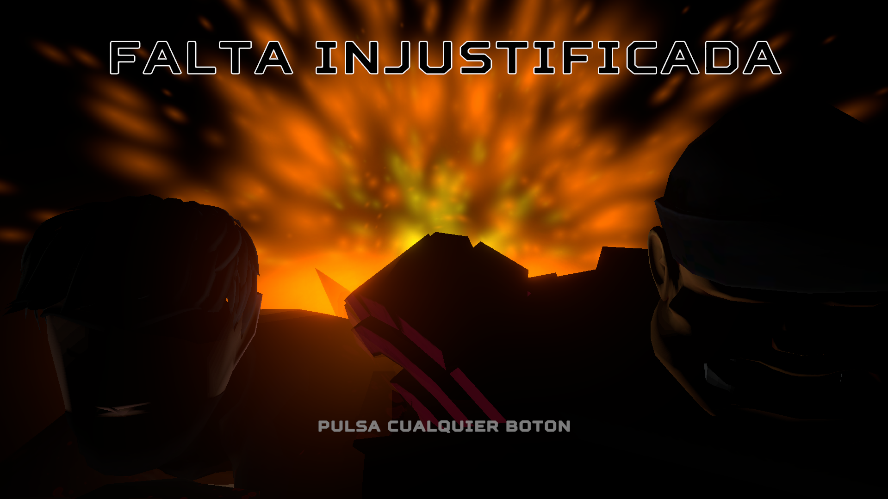

# FALTA-INJUSTIFICADA

> A stylized 2D fighting game with 3D graphics inspired by Guilty Gear, Marvel VS Capcom, JoJo's HFTF and Street Fighter.

---

# Overview

FALTA-INJUSTIFICADA is a fast-paced fighting game developed as a Final Degree Project using Unity.

The game combines:

* 2D gameplay mechanics
* 3D stylized graphics
* Character archetype-based design
* Technical gameplay systems
* Custom 3D assets and texturing

The project was entirely developed by a two-person team.

Artist: Miguel Cotta Merino:
Programmers: Miguel Cotta Merino: & José Luis Franco Mesa.

With the help of María Cotta Merino for the character select screen illustrations.

---

# Features

## Gameplay Systems

* Character selection screen
* 4 playable characters
* 4 skins per character
* Different gameplay archetypes
* Ultimate attacks
* Hitbox & hurtbox systems
* Combo systems
* Audio settings
* Graphics settings
* Resolution & fullscreen settings
* Stylized VFX
* Custom animations

---

# Characters

## Mamalón — Zoner

A mentally unstable baker who lost his sanity after spending too much time programming.

### Playstyle

* Long-range pressure
* Space control
* Projectile setups
* Delayed pressure

### Abilities

* Summons bread behind the opponent
* Long-range shovel attacks
* Spinning high-damage attack
* Teleport mixups
* Oven ultimate that continuously spawns homing bread projectiles

---

## Montero — Rushdown

A religious assassin trying to redeem himself from the sins of using ChatGPT during exams.

### Playstyle

* Aggressive pressure
* Fast dashes
* Close-range offense
* High risk / high reward

### Abilities

* Speed buff through prayer
* Nearly instant forward dash attack
* Air spinning attack
* Powerful hair-based knockdown
* One-hit KO ultimate attack

---

## BR34D&W4T3R — Grappler

A military cyborg built by the NetBeans Empire to eliminate the remaining rebels.

### Playstyle

* Slow movement
* Heavy damage
* Command grabs
* Pressure through intimidation

### Abilities

* Running command grab
* Air-launch command throw
* CAPTURATOR drone pressure
* Fast forward movement tool
* Countdown-based ultimate attack

---

## Camus — Gimmick

A dangerous scientist responsible for creating the BR34D&W4T3R units.

### Playstyle

* Unpredictable
* Trap-based gameplay
* Summons & utility tools
* Experimental mechanics

### Programming Commands

#### FOR Loop

Summons an orb that shoots seven projectiles.

#### WHILE Loop

Creates a persistent projectile source until Camus is interrupted.

#### TRY-CATCH Shield

Automatically blocks the next incoming attack.

#### IF Switch

Places an explosive trigger that launches opponents toward Camus.

### Ultimate

Compresses the opponent into a ZIP file, transforming them into a vulnerable WinRAR icon.

---

# Technical Breakdown

## Engine

* Unity
* C#

## 3D Pipeline

* Autodesk 3ds Max for modelling, rigging and animating
* Substance 3D Painter for texturing

## Systems Implemented

* Character state machines
* Combat systems
* Hit detection
* Animation handling
* UI systems
* Audio systems
* Input systems
* Visual effects
* Character archetype balancing

---

# Development Responsibilities

## Programming

* Gameplay systems
* Combat systems
* UI implementation
* Settings systems
* Character logic
* Animation integration

## 3D Art

* Character modeling
* Texturing
* Materials
* Stylized visual design
* Fast paced animations

---

# Installation

> *(Add download/build instructions here if desired)*

---

# Media

## Gameplay Video

> *(Insert YouTube gameplay link here)*

## Download

> *(Insert itch.io page here)*

---

# License

Copyright (c) 2026 Miguel Cotta Merino & José Luis Franco Mesa

All rights reserved.

This repository is provided for portfolio and demonstration purposes only.

No permission is granted to copy, modify, distribute, sublicense, or reuse any part of this project without explicit written permission from the author.

---

# Contact

LinkedIn: *https://www.linkedin.com/in/miguel-cotta-merino-9aaa53312/*

ArtStation: *https://www.artstation.com/miguelcm*

GitHub: *https://github.com/PikFanGitHub*
